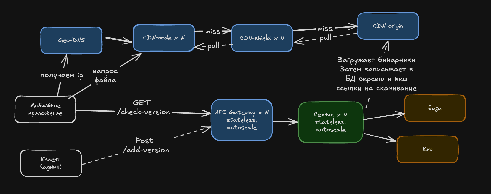

# ДЗ 1. Экстренная выкатка: 50 млн устройств за 6 часов

Условие лежит на странице домашки на платформе. Тут только твоё решение.
Идёшь по порядку: каждый шаг опирается на предыдущий.

## Уточняющие вопросы

Запиши свои до того, как откроешь карточку ответов интервьюера.

- Сколько весит обновление
- Принудительно ли мы устанавливаем обновление или по разрешению пользователя
- Нам для скачивания обновления нужно чтобы пользователь зашел в наше приложение или можем это сделать фоном? 
- Если пользователь должен быть в приложении для обновления - все устройства мы обновить не можем, какое количество пользователей в день пользуется приложением?
- Есть ли обратная совместимость у обновления с прежним API или нужно будет отдельно обрабатывать их запросы?

Ответы:
- 50 млн активных устройств
- размер обновления 80МБ
- должно обновиться 90% за 6 часов
- есть дельта обновления - 5МБ
- 80% на последней версии, нужна только дельта, 20% - фул обновление
- Можно обновляться без подтверждения со стороны юзера
- устройство спрашивает про обновление раз в 15 минут
- география - страна, 11 часовых поясов
- CDN - 1000р за 1ТБ

## Требования

Что система делает:

- Нужно передать обновление на клиент, на основании его версии приложения, чтобы не гонять лишний трафик 
- клиент сам опрашивает о наличие обновления раз в 15 минут, подтверждение юзера не нужно

Какой она должна быть по масштабу, скорости, надёжности:

- 50 млн устройтв
- нужно обновить >=90% устройств
- для старых версий - 80МБ, для новых 5МБ

## Прикидка

Считай столько, сколько нужно, чтобы понять порядок задачи.
Общий трафик (без учета ретраев) - 40млн * 5Mb + 10млн * 80Mb = 200Tb + 800Tb = 1000Tb = 1млн руб.
пропускная способность = 1000tb * 0.9 / 6 / 3600 = 41GB/s = 328Gbit/s

rps запросов на обновления = 50 млн / 15 / 60 =  55.56k
учитывая rps нужны реплики серверов, gateway и балансера + кеширование актуальной версии, чтобы не перегружать базу

Обновляем волнами, окна по 15 минут
Количество окон:
6 × 60 / 15 = 24

Целевая аудитория:
50 млн × 90% = 45 млн

Устройств в одной волне:
45 млн / 24 = 1,875 млн

Из них:
1,875 млн × 80% = 1,5 млн — дельта 5 МБ
1,875 млн × 20% = 0,375 млн — полный пакет 80 МБ

Трафик одной волны:
1,5 млн × 5 МБ + 0,375 млн × 80 МБ
= 7,5 ТБ + 30 ТБ
= 37,5 ТБ

## Модель данных

Главные объекты и связи между ними.

Version - {
    version: string
    fullPackage: bin
    fullPackageSize: number
    deltaPackage: bin
    deltaPackageSize: number
}

Update - {
    version: string
    downloadLink: string
}

## API

Три-пять ключевых операций.

GET /check-version?currentVersion=<version_string>&device_id=<uuid> Returns: Update - (пользователь скачивает обновление) | 204 если ласт версия

Post /add-version IN: Version - (админ загружает статику в CDN + создает версию в БД) Returns: 201
## Схема

Как запрос идёт по схеме:
Пользователь идет в гейтвей, тот передает запрос на сервис обновлений, сервис смотрит наличие обновления в кеше и возвращает ответ пользователю. При получении обновления пользователь идет в Geo-DNS, получает адрес ближайшего CDN сервера и идет к нему для скачивания файла обновления. При отстутствии файла на edge CDN - идет запрос к региональному shield, далее если его нет в кеше тот идет в origin

Админ отправляет запрос, тот проходит балансер, гейтвей, сервер грузит статику в CDN, получает ссылку, записывает в БД и в кеш информацию о последней версии

## Углубление

Разбери одно-два места глубоко, с расчётами.

Узкое место - скачивание приложение. Учитывая географическое распределение нам нужна сеть распределенных CDN. Для направления пользователя в правильный узел используем Geo DNS, также нас устроит anycast. Также нужен TTL 60-300 секунд для DNS, для оперативного перелючения при недоступности региона. Далее пользователь попадает в CDN-edge, при промахе в кеше edge обращается к региональному shield, shield уже идет в origin. Для того чтобы не перегревать origin используем singleflight, shield отправит всего 1 запрос в origin и всем будет возвращать ответ из уже прогретого кеша.

Учитывая предсказуемость нагрузки для CDN стоит выбрать pull стратегию и прогревать edge-ноды и только после этого делать в api обновление доступным для загрузки. Также сделать горизонтальный скейлинг делаем динамическим, и применяем его только в моменты выхода обновления, в другое время нет смысла переплачивать.

Но нагрузка все еще очень большая и мы не можем допустить одновременную загрузку всеми, поэтому искуственно должны контролировать отдачу обновления. Будем делать это на уровне сервиса. Учитывая разные часовые пояса определим где сейчас пользователи наиболее активны и будет обновлять этот регион в первую очередь. При запросе на обновление будем записывать в кеш пользователя, его и его версию и в каждом цикле будем брать наиболее "горячую группу", отдавать в ответе ссылку на новую версию и удалять запись из кеша, "холодной группе" обновление не отдаем пока не придет ее очередь. Также учитываем объем обновления, тк весомая разница в дельте и полном обновлении по трафику

Трафик распределен не равномерно, 200Tb - патч обновления, 800Tb полноценная загрузка приложения, поэтому важно возобновлять загрузку с места обрывания, клиент должен сохранять частично загруженный файл и отправлять HTTP range запрос offset загруженных данных, иметь ограничение на ретраи, экспонентный таймаут с jitter, чтобы не затопить базу ретраями. После успешного скачивания клиент должен сверять хеш сумму от полученного файла обновления с хешем из ответа сервера и в случае ошибки не устанавливать обновление, а делать повторную загрузку. Для обеспечения защиты от замены можно добавить KMS сервис и возвращать с ответом сервера подписанный хеш и открытый ключ для проверки файла обновления

Также большой rps на запрос про обновление, в кеше храним последнюю версию и ссылки на нее, чтобы не грузить каждый раз бд. 