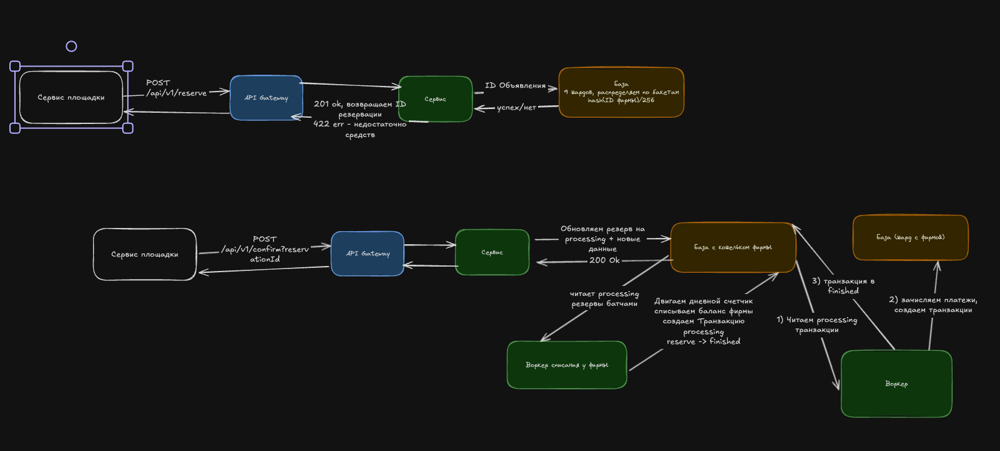

# ДЗ 2. Списать деньги 1,2 млрд раз в сутки и не уйти в минус

Условие лежит на странице домашки на платформе. Тут только твоё решение.
Идёшь по порядку: каждый шаг опирается на предыдущий.

## Уточняющие вопросы

Запиши свои до того, как откроешь карточку ответов интервьюера.

- Как распеределяется бюджет? Мы заранее закладываем сумму на каждую из площадок, на которой хотим потратить или она не фиксирована/есть только минимум?
- Как мы узнаем о количестве потраченного бюджета площадкой? Раз в какое-то время или в день?
- Мы должны точно не уходить в минус или можем уйти в небольшой минус, но реализовать норму по показам?
- Какое количество рекламных компаний у нас ожидается всего, сколько из них в среднем в день проводят свои компании?
- Можем ли мы менять бюджет согласованной компании или остановить ее?
- Что входит в скоуп задачи? Проектируем ли создание фирмы/рекламных компаний/добавление объявлений? Проектируем ли взаимодействие с площадками?

## Требования

Что система делает:

- Позволяет добавлять фирму, несколько рекламных компаний в одну фирму, каждая компания состоит из нескольких объявлений
- Бюджет выделяется на всю фирму, на рекламную компанию есть дневной лимит
- Свои площадки запрашивают бюджет на каждый показ, сторонние - запрашивают на пачку с задержкой до 5 мин/часа
- событие открутки на клик
- партнеры получают разрешение заранее, а после присылают отчет о состоявшемся событии

Какой она должна быть по масштабу, скорости, надёжности:

- Показов 1.2млрд в сутки, пик x3
- рекламодателей 500к
- Перерасход допустим не более 1% дневного бюджета компании
- Перерасход и недорасход - одинакого плохо, в идеале уложиться в бюджет
- "горячий юзер" до 2к объявлений в сек
- храним события 13 мес
- Один регион и ДЦ

## Прикидка

Считай столько, сколько нужно, чтобы понять порядок задачи.
показов = 1.2млрд, 50% показы, 50% - клики
показы - 600млн по 250р/1000 = 150млн. Р
клики - 6млн по 25р = 150млн. Р
показы для кликов - 600 млн
средний rpc = 1.206млрд событий в сутки = 13958.33 
пиковый (х3) = 41875.99
предел транзакционной базы = 5000rps/узел, для выдерживания пика нужно 9 узлов
предел хранилища = 10Tb/узел, вставка до 100 000rps/узел
бюджеты компаний от 3к.Р до 5 млн.Р

храним событий = 1.206млрд * 12 * 31 = 448.64мрлд
событие 200 байт = 200байт * 448.64мрлд = 200GB * 448.64 = 89.72Tb
итого 10 инстансов

## Модель данных

Есть 2 сценария:
1) Выдача разрешения
 -  Получаем в запросе id объявления и id площадки, тип события и количество

 -  По объявлению получаем таблицу рекламной компании, смотрим ее дневной бюджет, вычисляем заблокированную сумму прибавлем к затраченному дневному счетчику и смотрим что списание умещается в лимит
 -  Проверяем баланс фирмы с вычетом заблокированных средств по всем рекламным компаниям фирмы
 -  Если средств достаточно - создаем запись в резерве о сумме для события, возвращаем id записи резерва

 2) Получение окончательного отчёта по резерву. Площадка должна считать количество, если придет больше согласованного числа событий - мы оплачиваем только согласованный максимум, если меньше - учитываем это при подсчете
    - Записываем в резерв фактически затраченную сумму
    - Записываем созданные события в таблицу событий
    - меняем статус резерва на processing

    В асинхронном воркере читаем записи в таблице РЕЗЕРВ строки со статусом processing  и делаем транзакцию:
    -   Меняем статус резерва на finished
    -   Увеличиваем дневной счетчик рекламной компании на сумму события
    -   Создаем записи в таблице транзакций со статусом processing
    -   Группируем затраченную сумму на операции по фирме и вычитаем из каждого кошелька за 1 операцию всю сумму сразу

    В другом асинхронном воркере читаем записи в таблицы ТРАНЗАКЦИЯ в статусе processing и делаем 2 транзакции:
    1) на шарде хранящем площадку
        -   Зачисляем сумму на баланс площадки
        -   Создаем транзакцию о зачислении
    2) отдельной транзакцией на шарде с фирмой
        -   Меняем статус транзакции с processing на finished

    В случае падения после выполнения первой транзакции воркер увидит что транзакция уже создана и просто скипнет первую транзакцию и сменит статус во второй

Главные объекты и связи между ними.
Нужны сущности - фирма, рекламная компания, объявление, площадка, резерв, событие, транзакция

Фирма

| ID | Название |
| --- | --- |

Рекламная компания

| ID | Название | Дневной бюджет |
| --- | --- | --- |

Объявление

| ID | Название | Контент (JSONB с разметкой карточки) |
| --- | --- | --- |

Площадка

| ID | Название |
| --- | --- |

Транзакция

| ID | ID кошелька | сумма | Тип операции | Дата транзакции | ID записи резерва | Статус (enum processing | finished | canceled) |
| --- | --- | --- | --- | --- | --- | --- |

Счетчик бюджета компании

| ID счетчика | Дата DD-MM-YY | ID Компании | Израсходованный бюджет |
| --- | --- | --- | --- |

Резерв

| ID резерва | ID фирмы | ID объявления | ID площадки | Согласованная сумма | фактическая сумма | expires_at (date-time + 1h задержки) | status (enum = active, processing, finished, canceled) |
| --- | --- | --- | --- | --- | --- | --- | --- |

Событие

| ID | id объявления | тип события | id площадки | id транзакции (при наличии) | ID резерва | Время события |
| --- | --- | --- | --- | --- | --- | --- |

Кошелек

| ID кошелька | сумма | ID сущности (фирма/площадка) |
| --- | --- | --- |

Индекс по ID сущности, для ускорения поиска и связи.

связи:
1) фирма - рекламная компания
2) рекламная компания - объявление

## API

/api/v1/reserve - запрос бюджета для показа
payload - {
    type: click | show
    market-uuid: UUID площадки
    ad-uuid: UUID Объявления
    events_count: int - число событий, для разового 1, для батча - размер батча
} 

response:
1) недостаточно средств - 422 body = {data: {message: "Недостаточно средств у клиента", error: "insufficient_funds" | "daily_limit_exceeded"}}
2) Средств достаточно - 201, body = {data: {status: ok, reservationID: string}}

/api/v1/confirm?reservationId=<string>
payload - {
    events : []Event
}

Event = {type: click | show, eventId: string, time: datetime-string}
response: 200 ok
404 - reservation Not found
409 - timeout {data: {message: "Недостаточно средств у клиента", error:"reservation_expired"}- резерв вышел из лимита по времени}

## Схема

Как запрос идёт по схеме:
1) Площадка делает запрос по ручке /api/v1/reserve с информацией об объявлении и планируемом событии. Логику выбора доступного заказа можно реализовать на стороне сервиса -  предвысчитывать доступные для выполнения, либо вычислять во время запроса, в рамках задачи стоит процессинг оплаты, поэтому пока оставим за скобкой.

По объявлению получаем таблицу рекламной компании, смотрим ее дневной бюджет, вычисляем заблокированную сумму прибавлем к затраченному дневному счетчику и смотрим что списание умещается в лимит
 -  Проверяем баланс фирмы с вычетом заблокированных средств по всем рекламным компаниям фирмы
 -  Если средств достаточно - создаем запись в резерве о сумме для события, возвращаем id записи резерва

2) Подвержение операции идем по ручке /api/v1/confirm?reservationId=<string> передаем список событий. Сервис заносит количество событий, если придет больше согласованного числа событий - мы оплачиваем только согласованный максимум, если меньше - учитываем это при подсчете
    - Записываем в резерв фактически затраченную сумму
    - Записываем созданные события в таблицу событий
    - меняем статус резерва на processing

    В асинхронном воркере читаем записи в таблице РЕЗЕРВ строки со статусом processing  и делаем транзакцию:
    -   Меняем статус резерва на finished
    -   Увеличиваем дневной счетчик рекламной компании на сумму события
    -   Создаем записи в таблице транзакций со статусом processing
    -   Группируем затраченную сумму на операции по фирме и вычитаем из каждого кошелька за 1 операцию всю сумму сразу

    В другом асинхронном воркере читаем записи в таблицы ТРАНЗАКЦИЯ в статусе processing и делаем 2 транзакции:
    1) на шарде хранящем площадку
        -   Зачисляем сумму на баланс площадки
        -   Создаем транзакцию о зачислении
    2) отдельной транзакцией на шарде с фирмой
        -   Меняем статус транзакции с processing на finished

    В случае падения после выполнения первой транзакции воркер увидит что транзакция уже создана и просто скипнет первую транзакцию и сменит статус во второй

## Углубление

### Шардирование

Операционные данные распределяем по ID фирмы. Кошелёк фирмы,
её рекламные кампании, объявления, резервы, дневные счётчики
и записи о списаниях размещаем на одном шарде. Это позволяет
проверять ограничения, резервировать и списывать деньги
в локальных транзакциях.

Для маршрутизации используем виртуальные бакеты:
bucket = hash(firm_id) % 256.
Отдельное соответствие определяет физический шард каждого бакета.

Информацию для определения бакета можно включать в ID объявления
и резерва, чтобы находить нужный шард без предварительного поиска
фирмы на других шардах. Само размещение связанных данных должно
использовать тот же ключ шардирования.

### Защита от параллельного резервирования

Проверка доступных средств и создание резерва выполняются
в одной транзакции.

Перед проверкой захватываем блокировку строки кошелька фирмы
и строки дневного счётчика нужной рекламной кампании.
Все обработчики используют одинаковый порядок захвата блокировок.

После получения блокировок проверяем актуальные значения:
- баланс фирмы за вычетом зарезервированных средств должен
  покрывать новый резерв;
- потраченный бюджет кампании вместе с действующими резервами
  и новым резервом должен укладываться в дневной лимит.

Если проверки пройдены, создаём резерв и фиксируем транзакцию.
Блокировки освобождаются только после её завершения.
Все запросы создания резервов одной фирмы соблюдают этот протокол.

Для подсчёта зарезервированных средств не требуется блокировать
каждую прочитанную строку резерва. Однако воркер списания,
обновляющий тот же кошелёк и счётчик, будет конкурировать
с резервированием за их блокировки.

### Горячая фирма

По условию возможен пик 2000 оплачиваемых событий в секунду
на один кошелёк. Расчёт среднего числа событий через дневной
бюджет не заменяет проверку этого пика.

Производительность узла в 5000 транзакций в секунду также
не гарантирует такую же скорость обновления одной строки:
операции одного кошелька конкурируют за общую блокировку.

Для уменьшения количества обновлений кошелька воркер объединяет
списания по фирме. Дневные счётчики при этом обновляются отдельно
по рекламным кампаниям, а детализация сохраняется
в финансовых записях.

Отдельным узким местом остаётся выдача разрешений.
Если при каждом запросе под блокировкой вычислять SUM по резервам,
время удержания блокировки зависит от количества этих записей.

Возможное улучшение — хранить агрегированную зарезервированную
сумму по фирме и по кампании за день, сохраняя отдельные резервы.
Тогда агрегаты потребуется атомарно изменять вместе с созданием,
подтверждением, отменой и окончательным списанием резервов.

Для подтверждения производительности нужно оценить частоту
резервирований и списаний с учётом размеров пачек, а затем
проверить время удержания блокировок и ожидания на горячем кошельке.
До этой проверки проблема горячей фирмы не считается закрытой.